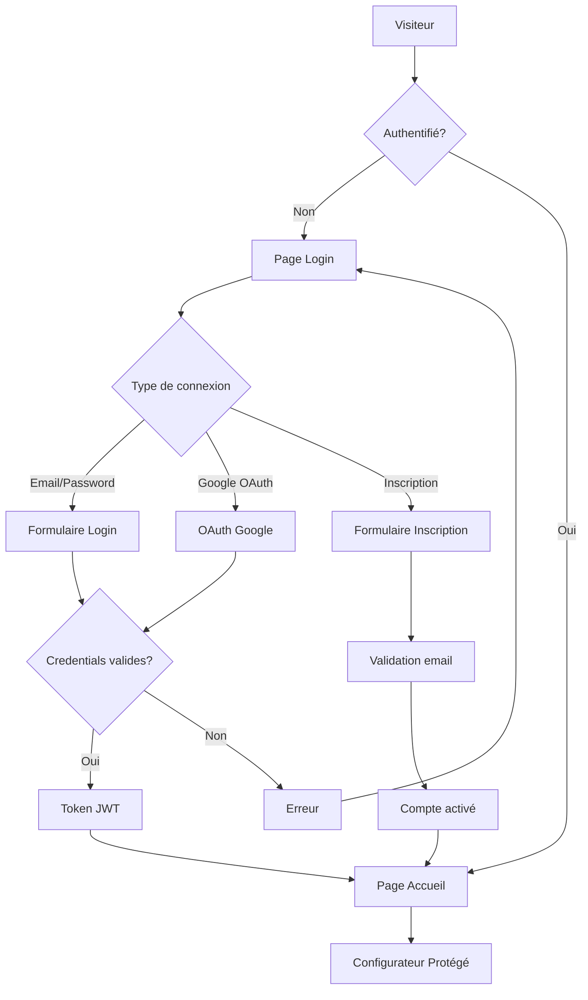

# 🔐 Stratégie d'Authentification et Backend
## La Manufacture de la Porte

---

## 📋 Vue d'ensemble

Ce document définit la stratégie pour implémenter un système d'authentification complet avec backend pour sécuriser l'accès au configurateur de porte.

### 🎯 Objectifs
- Contrôler l'accès au configurateur de porte
- Gérer les comptes utilisateurs (clients, partenaires, admin)
- Sauvegarder les configurations personnalisées
- Traçabilité des commandes et devis

---

## 🏗️ Architecture Proposée

### Frontend (React/TypeScript)
```
┌─────────────────────┐
│   Page de Login     │ ← Point d'entrée obligatoire
│   (/login)          │
└─────────┬───────────┘
          │
          ▼
┌─────────────────────┐
│   Page d'Accueil    │ ← Accessible après auth
│   (/)               │
└─────────┬───────────┘
          │
          ▼
┌─────────────────────┐
│   Configurateur     │ ← Protégé par auth
│   (/config)         │
└─────────────────────┘
```

### Backend Options

#### Option 1: Firebase (Recommandée)
**Avantages :**
- ✅ Authentification intégrée (email/password, Google, etc.)
- ✅ Base de données Firestore en temps réel
- ✅ Hébergement inclus
- ✅ Sécurité enterprise
- ✅ Pas de serveur à maintenir

**Services utilisés :**
- **Firebase Auth** : Gestion des comptes
- **Firestore** : Stockage des configurations
- **Firebase Hosting** : Déploiement (alternative à Netlify)
- **Cloud Functions** : API pour logique métier

#### Option 2: Backend Node.js + PostgreSQL
**Avantages :**
- ✅ Contrôle total
- ✅ Base de données relationnelle
- ✅ API REST personnalisée

**Stack technique :**
- **Express.js** : Serveur API
- **PostgreSQL** : Base de données
- **JWT** : Tokens d'authentification
- **bcrypt** : Hashage des mots de passe
- **Vercel/Railway** : Hébergement backend

---

## 🔐 Système d'Authentification

### Types d'Utilisateurs

#### 1. **Clients** (Particuliers)
- Accès au configurateur
- Sauvegarde de leurs projets
- Historique des configurations
- Demande de devis

#### 2. **Partenaires** (Professionnels)
- Accès privilégié au configurateur
- Gestion de plusieurs projets clients
- Tarifs préférentiels
- Export en lots

#### 3. **Administrateurs**
- Gestion des utilisateurs
- Analytics et statistiques
- Gestion du catalogue produits
- Validation des commandes

### Flux d'Authentification



---

## 📊 Base de Données

### Structure Firestore (Option 1)

#### Collection `users`
```javascript
{
  uid: "user123",
  email: "client@example.com",
  displayName: "Jean Dupont",
  role: "client", // client | partner | admin
  company: "Entreprise XYZ", // optionnel pour partenaires
  createdAt: timestamp,
  lastLogin: timestamp,
  isActive: true
}
```

#### Collection `configurations`
```javascript
{
  id: "config123",
  userId: "user123",
  name: "Porte Salon",
  svgData: "...", // SVG modifié
  parameters: {
    OUVERTURE_L: "902",
    PORTE_L: "816",
    PASSAGE_L: "790",
    CLOISON_E: "74",
    // ...
  },
  createdAt: timestamp,
  updatedAt: timestamp,
  isPublic: false
}
```

#### Collection `projects` (pour partenaires)
```javascript
{
  id: "project123",
  partnerId: "user456",
  clientName: "M. Martin",
  clientEmail: "martin@example.com",
  configurations: ["config123", "config456"],
  status: "draft", // draft | quoted | ordered | completed
  quotedPrice: 1250.00,
  notes: "Porte sur mesure pour salon",
  createdAt: timestamp
}
```

### Structure PostgreSQL (Option 2)

```sql
-- Table utilisateurs
CREATE TABLE users (
  id SERIAL PRIMARY KEY,
  email VARCHAR(255) UNIQUE NOT NULL,
  password_hash VARCHAR(255) NOT NULL,
  display_name VARCHAR(255),
  role VARCHAR(50) DEFAULT 'client',
  company VARCHAR(255),
  created_at TIMESTAMP DEFAULT NOW(),
  last_login TIMESTAMP,
  is_active BOOLEAN DEFAULT true
);

-- Table configurations
CREATE TABLE configurations (
  id SERIAL PRIMARY KEY,
  user_id INTEGER REFERENCES users(id),
  name VARCHAR(255) NOT NULL,
  svg_data TEXT,
  parameters JSONB,
  created_at TIMESTAMP DEFAULT NOW(),
  updated_at TIMESTAMP DEFAULT NOW(),
  is_public BOOLEAN DEFAULT false
);

-- Table projets (pour partenaires)
CREATE TABLE projects (
  id SERIAL PRIMARY KEY,
  partner_id INTEGER REFERENCES users(id),
  client_name VARCHAR(255),
  client_email VARCHAR(255),
  status VARCHAR(50) DEFAULT 'draft',
  quoted_price DECIMAL(10,2),
  notes TEXT,
  created_at TIMESTAMP DEFAULT NOW()
);
```

---

## 🔧 Implémentation Frontend

### 1. Contexte d'Authentification

```typescript
// src/contexts/AuthContext.tsx
interface User {
  uid: string
  email: string
  displayName: string
  role: 'client' | 'partner' | 'admin'
  company?: string
}

interface AuthContextType {
  user: User | null
  loading: boolean
  login: (email: string, password: string) => Promise<void>
  logout: () => Promise<void>
  register: (email: string, password: string, displayName: string) => Promise<void>
}
```

### 2. Hook d'Authentification

```typescript
// src/hooks/useAuth.ts
export function useAuth() {
  const context = useContext(AuthContext)
  if (!context) {
    throw new Error('useAuth must be used within AuthProvider')
  }
  return context
}
```

### 3. Composant de Protection de Route

```typescript
// src/components/ProtectedRoute.tsx
interface ProtectedRouteProps {
  children: React.ReactNode
  requiredRole?: 'client' | 'partner' | 'admin'
}

export function ProtectedRoute({ children, requiredRole }: ProtectedRouteProps) {
  const { user, loading } = useAuth()
  
  if (loading) return <LoadingSpinner />
  if (!user) return <Navigate to="/login" />
  if (requiredRole && user.role !== requiredRole) return <AccessDenied />
  
  return <>{children}</>
}
```

### 4. Pages d'Authentification

```typescript
// src/pages/LoginPage.tsx
- Formulaire email/password
- Lien "Mot de passe oublié"
- Lien "Créer un compte"
- OAuth Google (optionnel)

// src/pages/RegisterPage.tsx
- Formulaire d'inscription
- Sélection du type de compte (client/partenaire)
- Validation email
```

---

## 🎨 Design de la Page de Login

### Style Gaming/Moderne
- **Fond sombre** cohérent avec le design actuel
- **Accents dorés** (laiton #DAA520) pour les boutons
- **Animations subtiles** au survol
- **Logo centré** en haut
- **Formulaire élégant** avec validation en temps réel

### Éléments visuels
- Texture granuleuse sur les boutons (cohérent avec la mémoire design)
- Effets de glow/lueur sur les éléments interactifs
- Transitions fluides
- Responsive design

---

## 🔄 Flux Utilisateur Complet

### 1. Première Visite
```
Visiteur → Page Login → Inscription → Validation Email → Page Accueil → Configurateur
```

### 2. Utilisateur Existant
```
Visiteur → Page Login → Authentification → Page Accueil → Configurateur
```

### 3. Session Active
```
Visiteur → (Token valide) → Page Accueil → Configurateur
```

---

## 💾 Fonctionnalités Backend

### API Endpoints (Firebase Functions ou Express)

#### Authentification
- `POST /api/auth/login` - Connexion
- `POST /api/auth/register` - Inscription
- `POST /api/auth/logout` - Déconnexion
- `POST /api/auth/refresh` - Renouvellement token
- `POST /api/auth/forgot-password` - Mot de passe oublié

#### Configurations
- `GET /api/configurations` - Liste des configs utilisateur
- `POST /api/configurations` - Sauvegarder une config
- `PUT /api/configurations/:id` - Modifier une config
- `DELETE /api/configurations/:id` - Supprimer une config
- `GET /api/configurations/:id/share` - Partager une config

#### Projets (Partenaires)
- `GET /api/projects` - Liste des projets
- `POST /api/projects` - Créer un projet
- `PUT /api/projects/:id` - Modifier un projet
- `POST /api/projects/:id/quote` - Générer un devis

---

## 🛡️ Sécurité

### Mesures de Sécurité
- **HTTPS obligatoire** en production
- **Tokens JWT** avec expiration (24h)
- **Rate limiting** sur les endpoints sensibles
- **Validation côté serveur** de tous les inputs
- **CORS configuré** correctement
- **Sanitisation** des données SVG uploadées

### Variables d'Environnement
```env
# Firebase
VITE_FIREBASE_API_KEY=...
VITE_FIREBASE_AUTH_DOMAIN=...
VITE_FIREBASE_PROJECT_ID=...

# ou Backend custom
VITE_API_BASE_URL=https://api.manufacture-porte.com
JWT_SECRET=...
DATABASE_URL=...
```

---

## 📅 Plan de Développement

### Phase 1: Foundation (Semaine 1)
- [ ] Configuration Firebase ou setup backend
- [ ] Implémentation du contexte d'authentification
- [ ] Création de la page de login
- [ ] Protection des routes

### Phase 2: Fonctionnalités Core (Semaine 2)
- [ ] Page d'inscription
- [ ] Gestion des sessions
- [ ] Sauvegarde des configurations
- [ ] Interface utilisateur

### Phase 3: Fonctionnalités Avancées (Semaine 3)
- [ ] Gestion des rôles (client/partenaire/admin)
- [ ] Système de projets pour partenaires
- [ ] Export et partage de configurations
- [ ] Dashboard administrateur

### Phase 4: Optimisation (Semaine 4)
- [ ] Performance et cache
- [ ] Tests automatisés
- [ ] Documentation utilisateur
- [ ] Déploiement production

---

## 🚀 Recommandation

**Option choisie : Backend Node.js + PostgreSQL** 

### Avantages pour votre projet :

1. **🎛️ Contrôle total** : Logique métier personnalisée
2. **💾 Base de données relationnelle** : Parfait pour les relations complexes (users/projects/configs)
3. **🔧 Flexibilité** : Évolution facile selon vos besoins spécifiques
4. **💰 Coûts maîtrisés** : Pas de dépendance aux tarifs externes
5. **🏠 Indépendance** : Votre infrastructure, vos règles
6. **📊 Analytics avancés** : Contrôle total des données métier

---

## 🏗️ Architecture Backend Détaillée

### Stack Technique Recommandée

#### Backend
- **Node.js 20+** : Runtime JavaScript
- **Express.js** : Framework web rapide et minimaliste
- **TypeScript** : Typage statique pour la robustesse
- **PostgreSQL 15+** : Base de données relationnelle performante
- **Prisma ORM** : ORM moderne avec migrations automatiques
- **JWT** : Authentification stateless
- **bcrypt** : Hashage sécurisé des mots de passe
- **Joi/Zod** : Validation des données
- **Winston** : Logging professionnel

#### Hébergement
- **Railway.app** : Hébergement backend simple (recommandé)
- **Vercel** : Alternative pour API serverless
- **DigitalOcean** : VPS pour plus de contrôle
- **Neon.tech** : PostgreSQL managé gratuit

### Structure du Projet Backend

```
backend/
├── src/
│   ├── controllers/          # Logique des routes
│   │   ├── auth.controller.ts
│   │   ├── config.controller.ts
│   │   └── project.controller.ts
│   ├── middleware/           # Middlewares
│   │   ├── auth.middleware.ts
│   │   ├── validation.middleware.ts
│   │   └── rateLimit.middleware.ts
│   ├── models/              # Modèles Prisma
│   │   └── schema.prisma
│   ├── routes/              # Définition des routes
│   │   ├── auth.routes.ts
│   │   ├── config.routes.ts
│   │   └── project.routes.ts
│   ├── services/            # Logique métier
│   │   ├── auth.service.ts
│   │   ├── config.service.ts
│   │   └── email.service.ts
│   ├── utils/               # Utilitaires
│   │   ├── jwt.utils.ts
│   │   ├── password.utils.ts
│   │   └── validation.utils.ts
│   ├── config/              # Configuration
│   │   ├── database.ts
│   │   └── env.ts
│   └── app.ts               # Point d'entrée
├── prisma/
│   ├── migrations/          # Migrations DB
│   └── schema.prisma        # Schéma de base
├── tests/                   # Tests automatisés
├── package.json
├── tsconfig.json
└── .env.example
```

### Schéma de Base de Données Optimisé

```sql
-- Utilisateurs avec rôles
CREATE TABLE users (
  id SERIAL PRIMARY KEY,
  email VARCHAR(255) UNIQUE NOT NULL,
  password_hash VARCHAR(255) NOT NULL,
  display_name VARCHAR(255) NOT NULL,
  role user_role DEFAULT 'client',
  company VARCHAR(255),
  phone VARCHAR(50),
  address TEXT,
  created_at TIMESTAMP DEFAULT NOW(),
  updated_at TIMESTAMP DEFAULT NOW(),
  last_login TIMESTAMP,
  is_active BOOLEAN DEFAULT true,
  email_verified BOOLEAN DEFAULT false,
  verification_token VARCHAR(255)
);

-- Enum pour les rôles
CREATE TYPE user_role AS ENUM ('client', 'partner', 'admin');

-- Sessions pour sécurité renforcée
CREATE TABLE user_sessions (
  id SERIAL PRIMARY KEY,
  user_id INTEGER REFERENCES users(id) ON DELETE CASCADE,
  token_hash VARCHAR(255) NOT NULL,
  expires_at TIMESTAMP NOT NULL,
  created_at TIMESTAMP DEFAULT NOW(),
  ip_address INET,
  user_agent TEXT
);

-- Configurations sauvegardées
CREATE TABLE configurations (
  id SERIAL PRIMARY KEY,
  user_id INTEGER REFERENCES users(id) ON DELETE CASCADE,
  name VARCHAR(255) NOT NULL,
  description TEXT,
  svg_original TEXT, -- SVG d'origine
  svg_modified TEXT, -- SVG avec modifications
  parameters JSONB NOT NULL, -- Paramètres de cotation
  created_at TIMESTAMP DEFAULT NOW(),
  updated_at TIMESTAMP DEFAULT NOW(),
  is_public BOOLEAN DEFAULT false,
  is_template BOOLEAN DEFAULT false,
  tags TEXT[] -- Pour recherche et catégorisation
);

-- Projets (pour partenaires)
CREATE TABLE projects (
  id SERIAL PRIMARY KEY,
  partner_id INTEGER REFERENCES users(id),
  client_name VARCHAR(255) NOT NULL,
  client_email VARCHAR(255),
  client_phone VARCHAR(50),
  client_address TEXT,
  project_name VARCHAR(255) NOT NULL,
  description TEXT,
  status project_status DEFAULT 'draft',
  quoted_price DECIMAL(10,2),
  final_price DECIMAL(10,2),
  notes TEXT,
  created_at TIMESTAMP DEFAULT NOW(),
  updated_at TIMESTAMP DEFAULT NOW(),
  deadline DATE
);

CREATE TYPE project_status AS ENUM ('draft', 'quoted', 'approved', 'in_production', 'completed', 'cancelled');

-- Relation projets <-> configurations
CREATE TABLE project_configurations (
  id SERIAL PRIMARY KEY,
  project_id INTEGER REFERENCES projects(id) ON DELETE CASCADE,
  configuration_id INTEGER REFERENCES configurations(id) ON DELETE CASCADE,
  quantity INTEGER DEFAULT 1,
  unit_price DECIMAL(10,2),
  notes TEXT,
  created_at TIMESTAMP DEFAULT NOW()
);

-- Logs d'activité pour audit
CREATE TABLE activity_logs (
  id SERIAL PRIMARY KEY,
  user_id INTEGER REFERENCES users(id),
  action VARCHAR(100) NOT NULL,
  resource_type VARCHAR(50), -- 'configuration', 'project', etc.
  resource_id INTEGER,
  details JSONB,
  ip_address INET,
  user_agent TEXT,
  created_at TIMESTAMP DEFAULT NOW()
);

-- Index pour performance
CREATE INDEX idx_users_email ON users(email);
CREATE INDEX idx_sessions_token ON user_sessions(token_hash);
CREATE INDEX idx_configs_user ON configurations(user_id);
CREATE INDEX idx_projects_partner ON projects(partner_id);
CREATE INDEX idx_activity_user ON activity_logs(user_id);
CREATE INDEX idx_activity_created ON activity_logs(created_at);
```

### API Endpoints Détaillés

#### 🔐 Authentification
```typescript
POST /api/auth/register
Body: { email, password, displayName, role?, company? }
Response: { user, token }

POST /api/auth/login  
Body: { email, password }
Response: { user, token }

POST /api/auth/logout
Headers: Authorization: Bearer <token>
Response: { success: true }

POST /api/auth/refresh
Headers: Authorization: Bearer <token>
Response: { token }

POST /api/auth/forgot-password
Body: { email }
Response: { message }

POST /api/auth/reset-password
Body: { token, newPassword }
Response: { success: true }
```

#### ⚙️ Configurations
```typescript
GET /api/configurations
Headers: Authorization: Bearer <token>
Query: ?page=1&limit=10&search=porte&tags=salon
Response: { configurations[], total, page }

POST /api/configurations
Body: { name, description?, svgOriginal, svgModified, parameters, tags? }
Response: { configuration }

PUT /api/configurations/:id
Body: { name?, description?, svgModified?, parameters?, tags? }
Response: { configuration }

DELETE /api/configurations/:id
Response: { success: true }

GET /api/configurations/:id/share
Response: { publicUrl, expiresAt }
```

#### 🏢 Projets (Partenaires)
```typescript
GET /api/projects
Query: ?status=draft&client=martin
Response: { projects[], total }

POST /api/projects
Body: { clientName, clientEmail?, projectName, description? }
Response: { project }

PUT /api/projects/:id
Body: { status?, quotedPrice?, notes?, deadline? }
Response: { project }

POST /api/projects/:id/configurations
Body: { configurationId, quantity?, unitPrice? }
Response: { projectConfiguration }

GET /api/projects/:id/quote
Response: { quoteData, totalPrice, pdf? }
```

### Sécurité Renforcée

#### Middleware d'Authentification
```typescript
// Vérification JWT sur toutes les routes protégées
const authMiddleware = (req, res, next) => {
  const token = req.headers.authorization?.split(' ')[1]
  if (!token) return res.status(401).json({ error: 'Token manquant' })
  
  try {
    const decoded = jwt.verify(token, process.env.JWT_SECRET)
    req.user = decoded
    next()
  } catch (error) {
    return res.status(401).json({ error: 'Token invalide' })
  }
}
```

#### Rate Limiting
```typescript
// Protection contre les attaques par force brute
const loginLimiter = rateLimit({
  windowMs: 15 * 60 * 1000, // 15 minutes
  max: 5, // 5 tentatives max
  message: 'Trop de tentatives de connexion'
})
```

### Prochaine étape
Développer le backend Node.js/Express avec PostgreSQL et créer l'API d'authentification.

---

*Document créé le 17 août 2025*
*Version 1.1 - Backend personnalisé*
